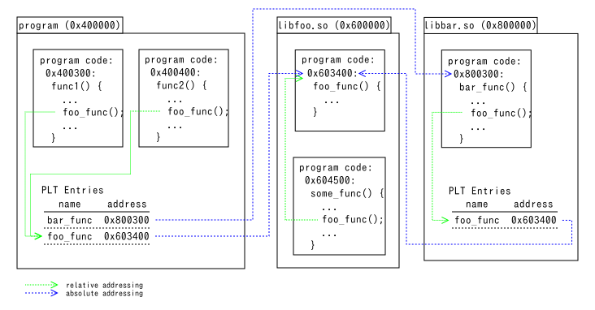
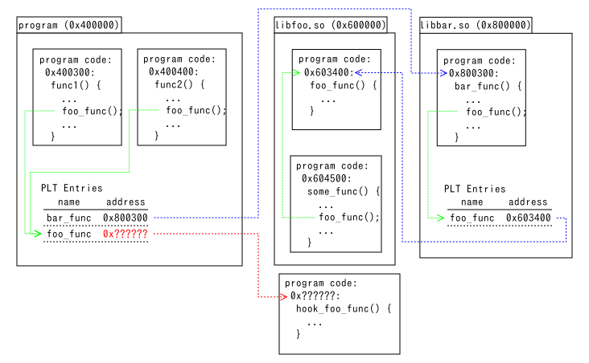
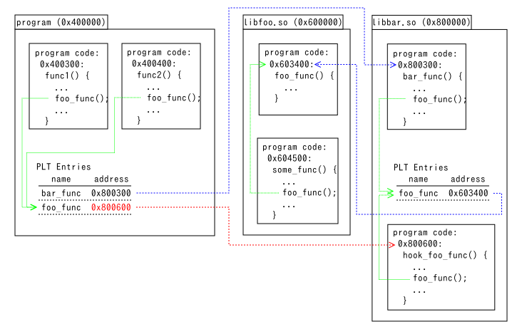
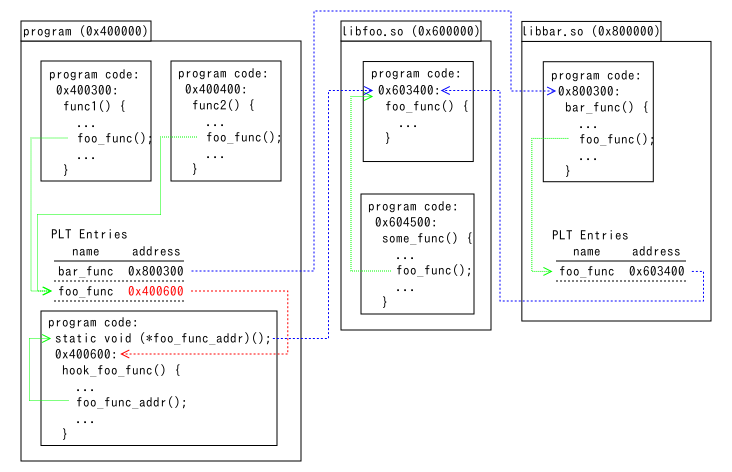

PLTHook
=======

[](https://travis-ci.com/kubo/plthook)

What is plthook.
----------------

A utility library to hook library function calls issued by
specified object files (executable and libraries). This modifies
PLT (Procedure Linkage Table) entries in ELF format used on most Unixes
or [IAT (Import Address Table)][IAT] entries in PE format used on Windows.

[IAT]: https://en.wikipedia.org/wiki/Portable_Executable#Import_Table

### What is PLT (or IAT)

Note: This isn't precise explanation. Some details are omitted.

When a function calls another function in another file, it is called via PLT (on
Unix using ELF) or IAT (on Windows).



In order to call `foo_func()` in `libfoo.so`, the address of the callee must be
known. When callers are in the same file, the relative address to the callee is
known at compile time regardless of the absolute address at run time. So
`some_func()` calls `foo_func()` using relative addressing.

When callers are in other files, the address of the callee cannot be known at
compile time. To resolve it, each file has a mapping from external function names
to addresses. The callers directly look at the address in the PLT entry for
`foo_func()` and jump to the address.

The addresses in PLT entries are resolved (1) at process startup or (2) at first
function call (lazy binding). It depends on OSes or on settings.

### What plthook does.



Plthook changes the address in PLT entries as above.
When `foo_func()` is called from `program`, `hook_foo_func()` is called instead.
It doesn't change function calls from `libfoo.so` and `libbar.so`.

### How to call original functions from hook functions.

#### When hook functions are outside of modified files



When the hook function `hook_foo_func()` is in `libbar.so`, just call the
original function `foo_func()`. It looks the PLT entry in `libbar.so` and jumps
to the original.

#### When hook functions are inside of modified files



When the hook function `hook_foo_func()` is in `program`, do not call the
original function `foo_func()` because it jumps to `hook_foo_func()` repeatedly
and crashes the process after memory for stack is exhausted. You need to get the
address of the original function and set it to the function pointer variable
`foo_func_addr`. Use the fourth argument of `plthook_replace()` to get the
address on Windows. Use the return value of `dlsym(RTLD_DEFAULT, "foo_func")` on
Unixes. The fourth argument of `plthook_replace()` isn't available on Unixes
because it doesn't set the address of the original before the address in the PLT
entry is resolved.

Changes
-------

**2019-02-17:** Support `plthook_open_by_address()` and change
internal logic of `plthook_open()` on Android.

**2019-02-17:** Stop checking RELRO and check memory protection at
runtime instead.

**2019-02-03:** Fix crash when programs are compiled with compiler options
`-Wl,-z,relro` and `-fno-plt` with the help of [JC Liang][]. ([#10][])

**2018-02-06:** Android support was contributed by [Daniel Deptford][].

**2017-10-01:** `plthook_elf.c` was rewritten. Plthook had needed to
read files on filesystem to get various information about target
object files. It now do it only for full RELRO object files.
Note that plthook before 2017-10-01 gets segmentation fault while
hooking a [prelinked file](https://en.wikipedia.org/wiki/Prelink#Linux) on Linux.

**2017-09-18:** Fixed for processes on [valgrind](valgrind.org/) on Linux.

Usage
-----

If you have a library `libfoo.so.1` and want to intercept
a function call `recv()` without modifying the library,
put `plthook.h` and `plthook_elf.c`, `plthook_win32.c` or `plthook_osx.c`
in your source tree and add the following code.

```c
#include "plthook.h"

/* This function is called instead of recv() called by libfoo.so.1  */
static ssize_t my_recv(int sockfd, void *buf, size_t len, int flags)
{
    ssize_t rv;
    
    ... do your task: logging, etc. ...
    rv = recv(sockfd, buf, len, flags); /* call real recv(). */
    ... do your task: logging, check received data, etc. ...
    return rv;
}
    
int install_hook_function()
{
    plthook_t *plthook;
    
    if (plthook_open(&plthook, "libfoo.so.1") != 0) {
        printf("plthook_open error: %s\n", plthook_error());
        return -1;
    }
    if (plthook_replace(plthook, "recv", (void*)my_recv, NULL) != 0) {
        printf("plthook_replace error: %s\n", plthook_error());
        plthook_close(plthook);
        return -1;
    }
    plthook_close(plthook);
    return 0;
}
```

The above code doesn't work when `my_recv()` is in the file opened by
`plthook_open()` as described [here](#when-hook-functions-are-inside-of-modified-files).
Use the following code instead in the case.

```c
static ssize_t (*recv_func)(int sockfd, void *buf, size_t len, int flags);

/* This function is called instead of recv() called by libfoo.so.1  */
static ssize_t my_recv(int sockfd, void *buf, size_t len, int flags)
{
    ssize_t rv;
    
    ... do your task: logging, etc. ...
    rv = (*recv_func)(sockfd, buf, len, flags); /* call real recv(). */
    ... do your task: logging, check received data, etc. ...
    return rv;
}
    
int install_hook_function()
{
    plthook_t *plthook;
    
    if (plthook_open_by_address(&plthook, &recv_func) != 0) {
        printf("plthook_open error: %s\n", plthook_error());
        return -1;
    }
    if (plthook_replace(plthook, "recv", (void*)my_recv, (void**)&recv_func) != 0) {
        printf("plthook_replace error: %s\n", plthook_error());
        plthook_close(plthook);
        return -1;
    }
#ifndef WIN32
    // The address passed to the fourth argument of plthook_replace() is
    // availabe on Windows. But not on Unixes. Get the real address by dlsym().
    recv_func = (ssize_t (*)(int, void *, size_t, int))dlsym(RTLD_DEFAULT, "recv");
#endif
    plthook_close(plthook);
    return 0;
}
```

Note that built-in functions cannot be hooked. For example the C
compiler in macOS Sierra compiles `ceil()` as inline assembly code,
not as function call of `ceil` in the system library.

When a functions is imported by [ordinal][] on Windows,
the function name is specified by `export_dll_name:@ordinal`.
For example `api-ms-win-shcore-path-l1-1-0.dll:@170`.

[ordinal]: https://msdn.microsoft.com/en-us/library/e7tsx612.aspx

Another Usage
-------------

PLTHook provides a function enumerating PLT/IAT entries.

```c
void print_plt_entries(const char *filename)
{
    plthook_t *plthook;
    unsigned int pos = 0; /* This must be initialized with zero. */
    const char *name;
    void **addr;

    if (plthook_open(&plthook, filename) != 0) {
        printf("plthook_open error: %s\n", plthook_error());
        return -1;
    }
    while (plthook_enum(plthook, &pos, &name, &addr) == 0) {
        printf("%p(%p) %s\n", addr, *addr, name);
    }
    plthook_close(plthook);
    return 0;
}
```

Supported Platforms
-------------------

| Platform | source file |
| -------- | ----------- |
| Linux i386 and x86_64 | plthook_elf.c |
| Linux arm, aarch64, powerpc and powerpc64le (*1) | plthook_elf.c |
| Windows 32-bit and x64 (MSVC, Mingw32 and Cygwin) | plthook_win32.c |
| macOS | plthook_osx.c
| Solaris x86_64 | plthook_elf.c |
| FreeBSD i386 and x86_64 except i386 program on x86_64 OS | plthook_elf.c |
| Android(*2) | plthook_elf.c |

*1 These are tested on [QEMU][], which version must be 2.2 or later, user-mode emulation.  
*2 Contributed by [Daniel Deptford][].

[QEMU]: http://www.qemu.org/
[ELF]: https://en.wikipedia.org/wiki/Executable_and_Linkable_Format
[Daniel Deptford]: https://github.com/redmercury
[JC Liang]: https://github.com/tntljc
[#10]: https://github.com/kubo/plthook/pull/10

License
-------

2-clause BSD-style license.
